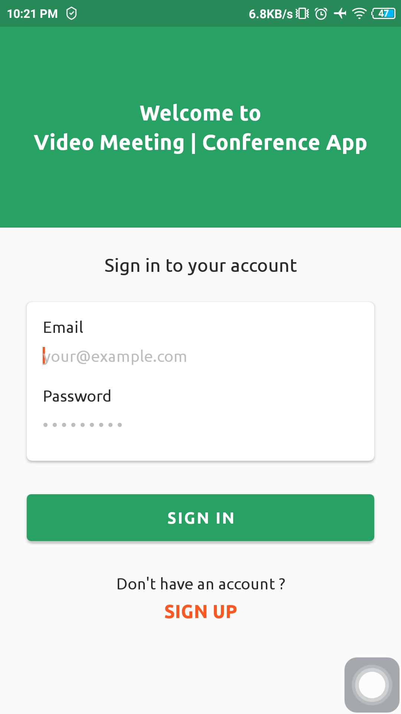
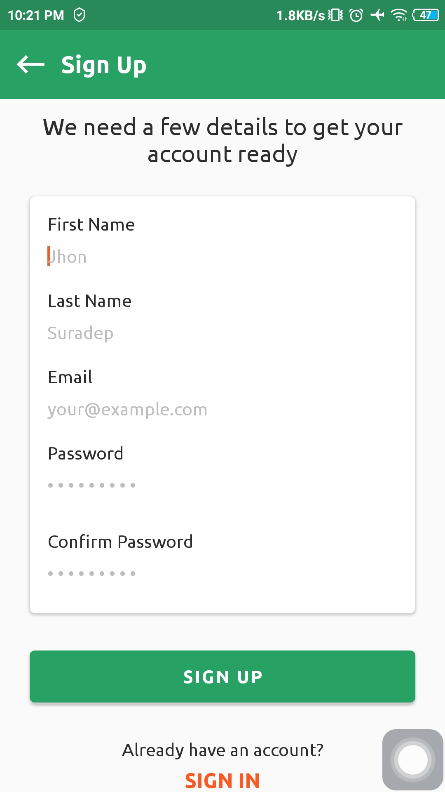
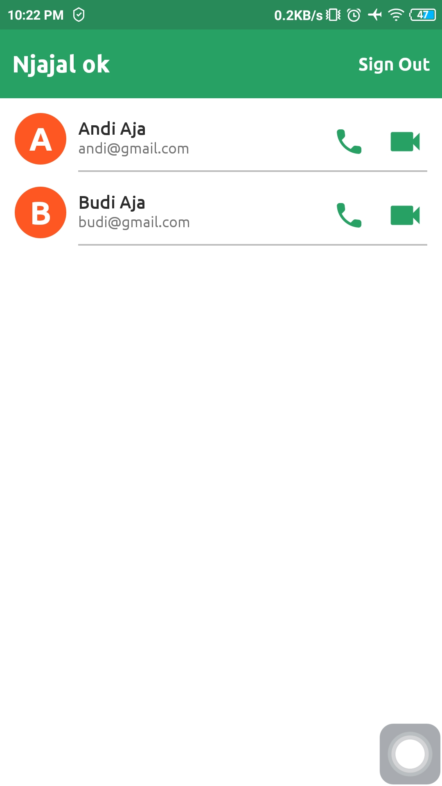
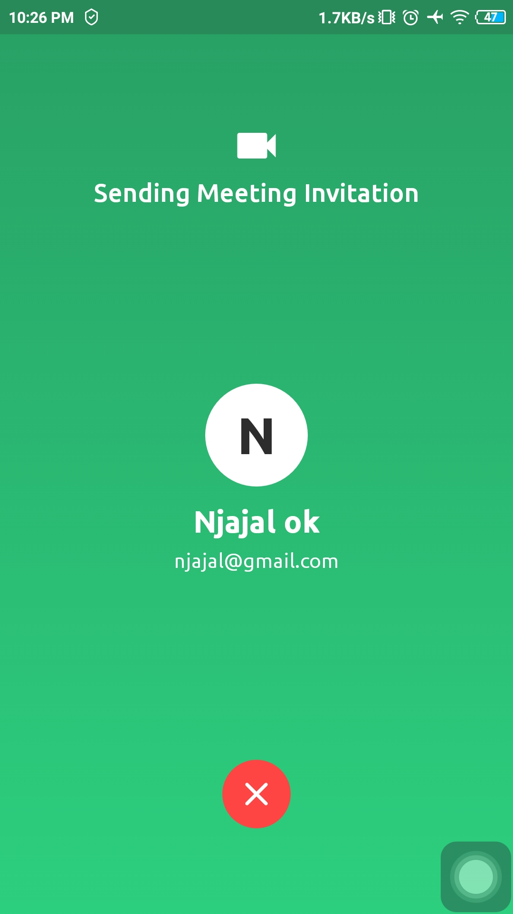
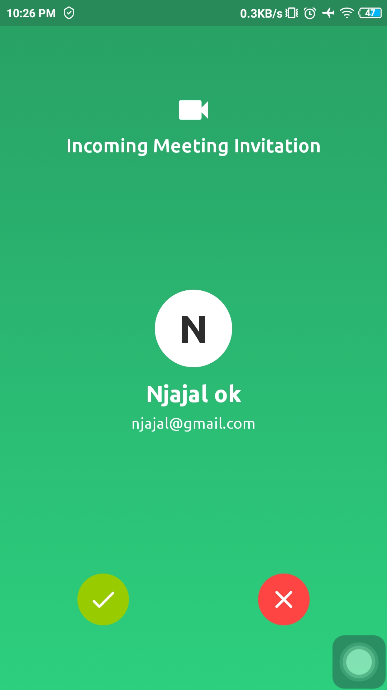
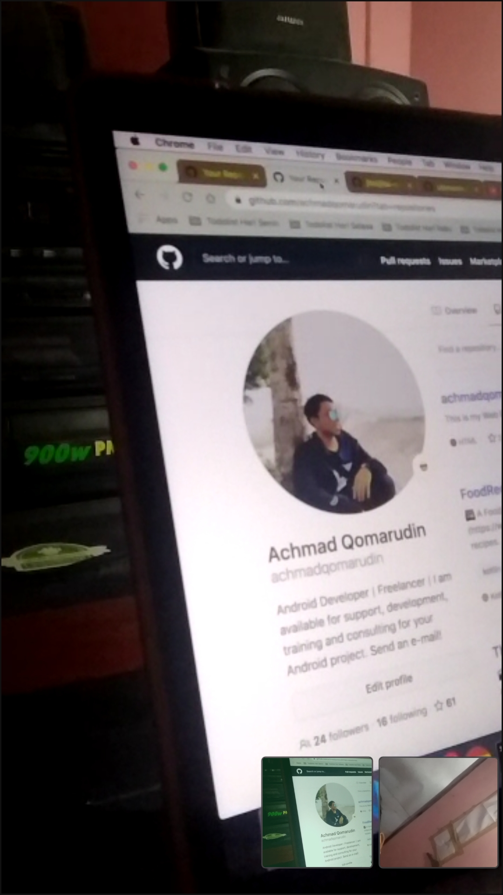
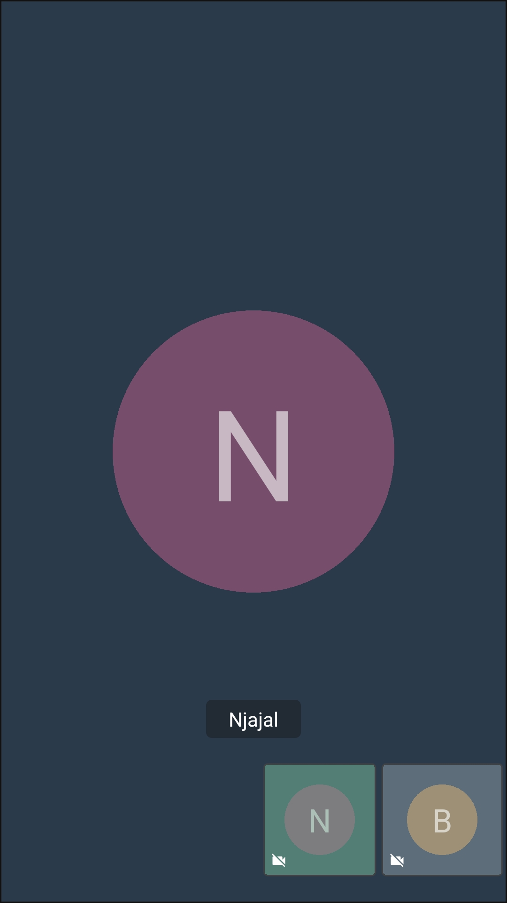
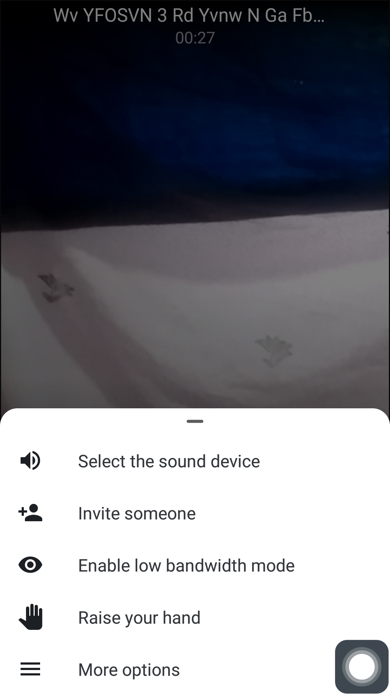
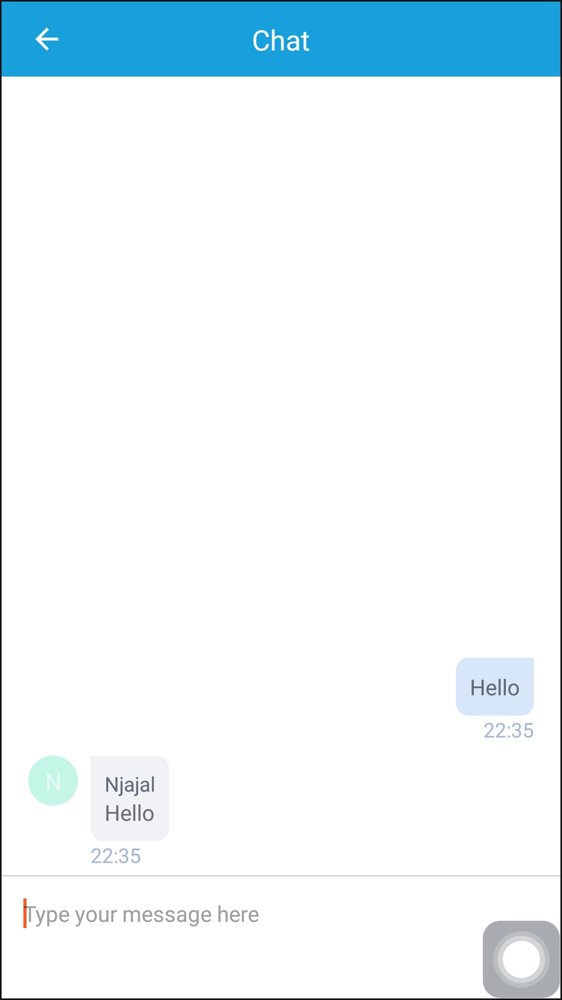

# Meeting App

[](https://www.android.com)
[](https://www.apache.org/licenses/LICENSE-2.0.html)
[](https://docs.gradle.org/current/release-notes)
[](https://java-lang.github.io/awesome-java)

👨‍💻 Android Video Meeting App or Conference App using Jitsi Meet SDK and Firebase. Secure, Simple and Scalable Video Conferences that you use as a standalone app or embed in your android application.

# Source
Repo to demonstrate Meeting App in Android app. This is a follow up on the youtube at :

[AndroidVideoMeeting](https://www.youtube.com/playlist?list=PLam6bY5NszYNR54PiY_NN7hGS858xinq-)

# Instruction

- How to Setup Firebase Cloud Messaging & Firestore? ([tutorial](https://youtu.be/P54aEc4QYzI))
- How to Change "API_KEY_SERVER" in "Constants.java" Class with your api key server? ([tutorial](https://youtu.be/cQkuWMB_9SY?list=PLam6bY5NszYNR54PiY_NN7hGS858xinq-&t=208))
- Still confused? Check out this complete video tutorial for step by step from the beginning ([tutorial](https://www.youtube.com/playlist?list=PLam6bY5NszYNR54PiY_NN7hGS858xinq-))

# Demo App

<p align="center">
  <a href="https://github.com/achmadqomarudin/MeetingApp/releases/latest/download/app-demo.apk">
    
  </a>
</p>

<table style="width:100%">
  <tr>
    <th>Example 1</th>
    <th>Example 2</th>
    <th>Example 3</th>
  </tr>
  <tr>
    <td></td>
    <td></td>
    <td></td>
  </tr>
  <tr>
    <th>Example 4</th>
    <th>Example 5</th>
    <th>Example 6</th>
  </tr>
  <tr>
    <td></td>
    <td></td>
    <td></td>
  </tr>
  <tr>
    <th>Example 7</th>
    <th>Example 8</th>
    <th>Example 9</th>
  </tr>
  <tr>
    <td></td>
    <td></td>
    <td></td>
  </tr>
</table>

# License

```
    Copyright (C) Achmad Qomarudin

    Licensed under the Apache License, Version 2.0 (the "License");
    you may not use this file except in compliance with the License.
    You may obtain a copy of the License at

       http://www.apache.org/licenses/LICENSE-2.0

    Unless required by applicable law or agreed to in writing, software
    distributed under the License is distributed on an "AS IS" BASIS,
    WITHOUT WARRANTIES OR CONDITIONS OF ANY KIND, either express or implied.
    See the License for the specific language governing permissions and
    limitations under the License.
```
